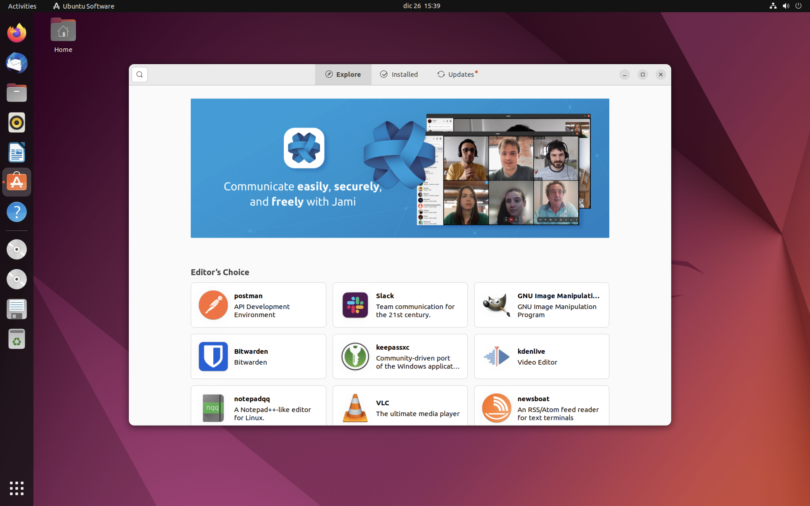
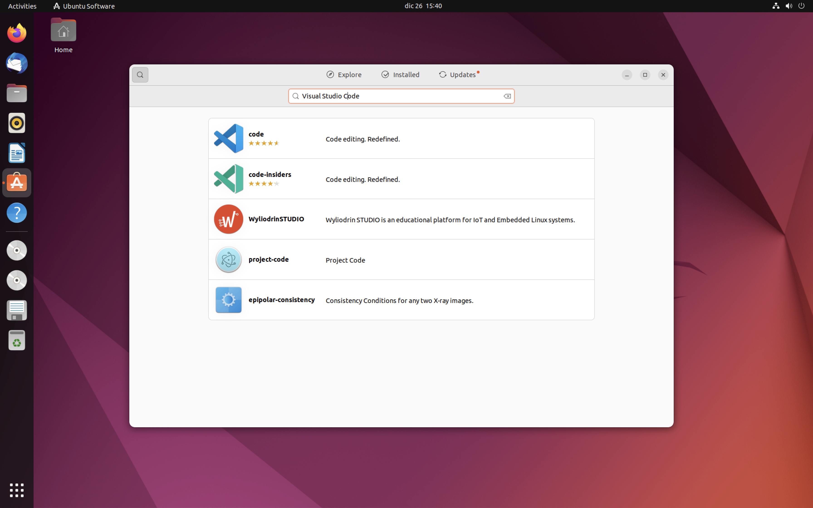
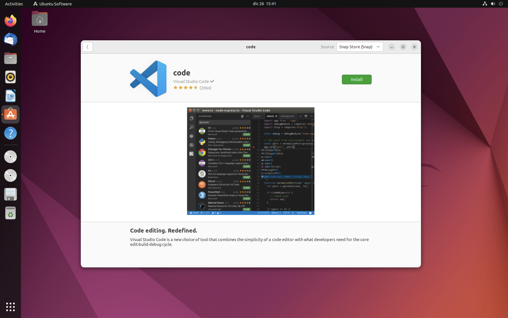
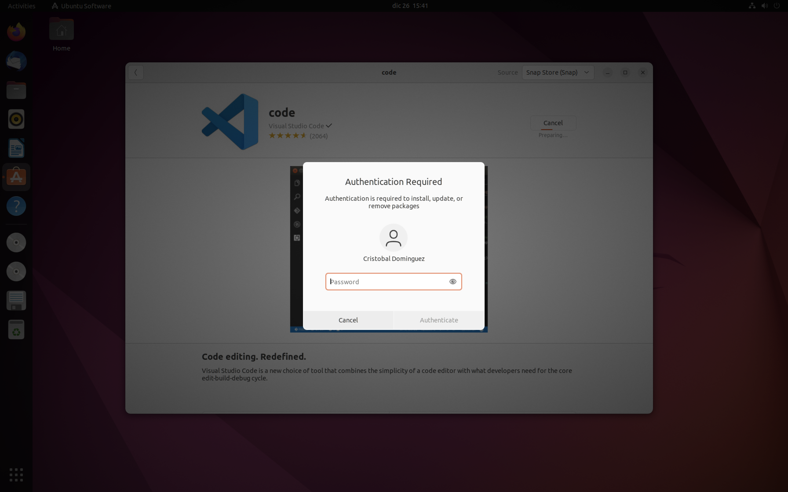
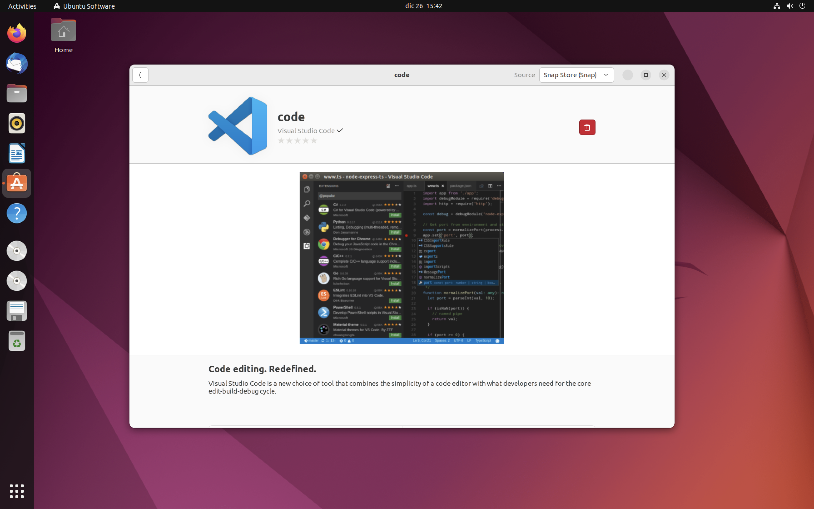
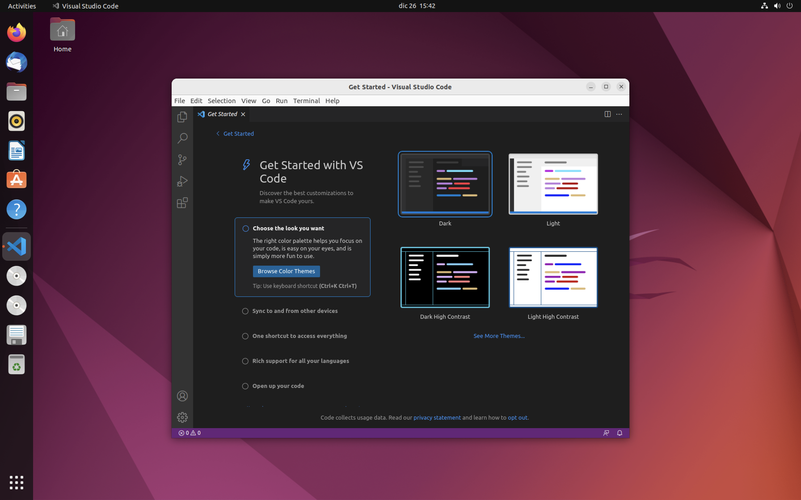
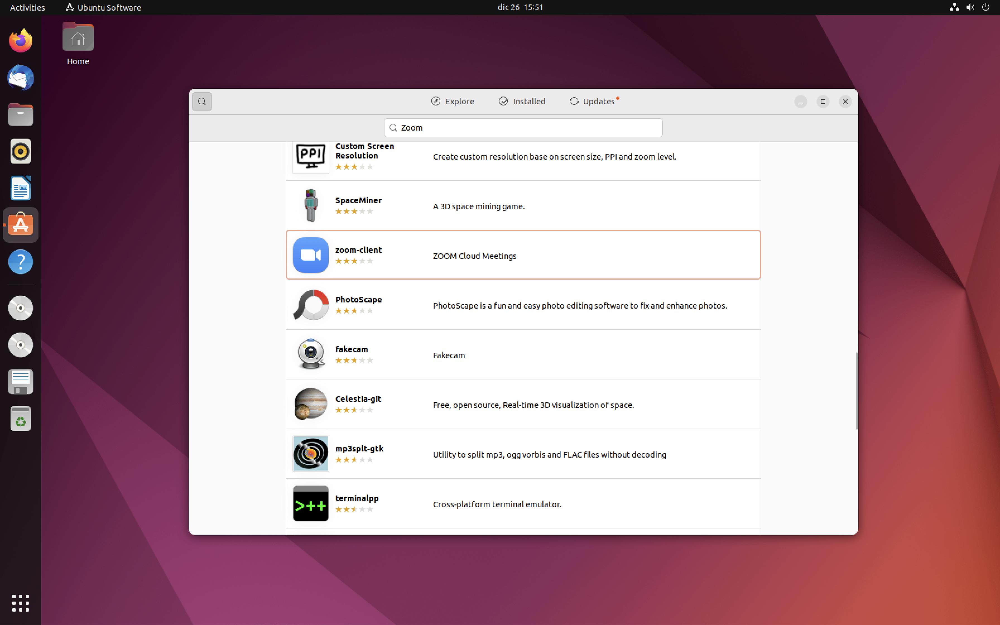
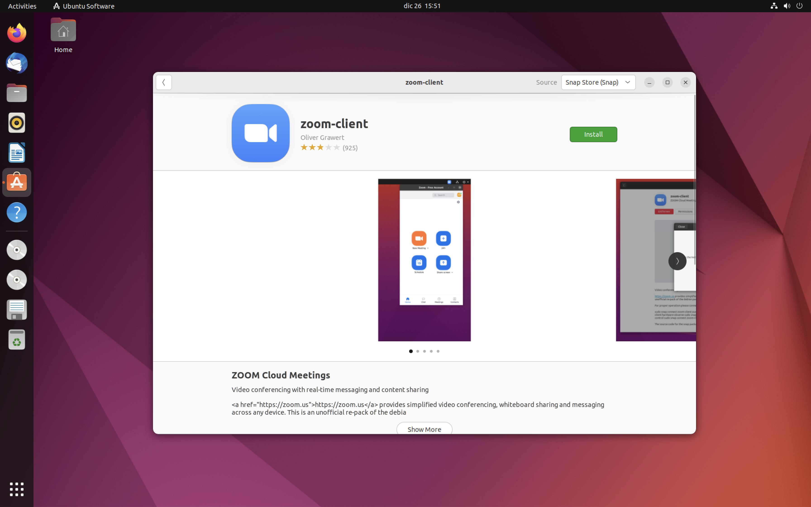
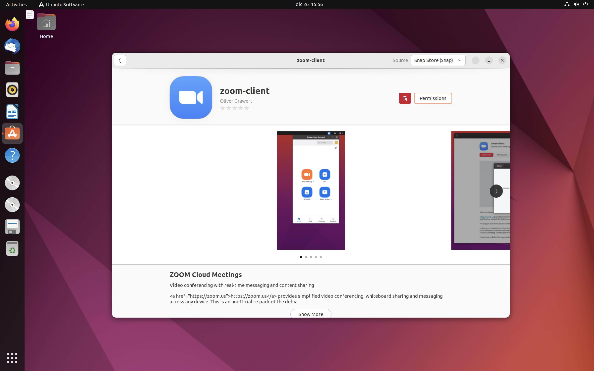
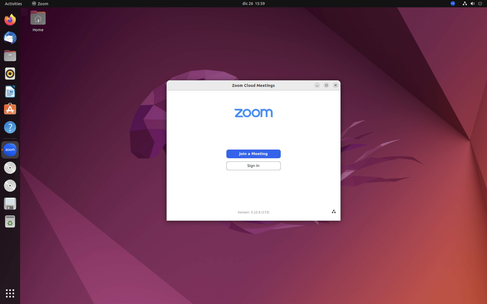

# Instalación SENAME


## Paso 01: instalación mínima.
### Requisitos para instalar
Esta instalación esta basada en Ubuntu 22.04, por favor instalar la actual versión del sistema operativo y asegurarse que todos los drivers funcionen correctamente. Una vez hechas las configuraciones seguir al siguiente paso.
El link desde donde fue descargada la versión de Ubuntu es: [esta](https://ubuntu.com/download/desktop/thank-you?version=22.04.1&architecture=amd64)


## Paso 02: instalación de Visual Studio Code y Zoom.
### Instalación de Visual Studio Code


1. Abrir app Ubuntu Software


2. Buscar Visual Studio Code


3. Instalar Visual Studio


4. Para instalar se necesitará la contraseña del sistema


5. Sabremos que se ha terminado de instalar porque ya no avanzará la instalación si no que se reemplazará por un botón rojo con una papelera.


6. La primera vez que abramos la app se verá así.


### Instalación de Zoom
La instalación de Zoom es similar a la de Visual Studio Code


1. en Ubuntu Software buscaremos Zoom Client


2. Una vez encontrada la aplicación la instalaremos de la misma forma que hicimos con Visual Studio Code.



3. Una vez instalada y abierta la aplicación se verá de esta forma.

## Paso 03: instalaciones en la Terminal
### Comandos para el inicio
Antes que nada, actualizaremos todo lo posible:

````
sudo apt update && sudo apt upgrade && sudo apt autoremove
````
### Instalación de GIT

````
sudo apt install git-all -y
````

### Instalación de NVM
NVM es un manejador de diferentes versiones de Node, importante cuando uno esta desarrollando es tener la posibilidad de cambiar cuantas veces sea necesario de versión de Node según sea necesario para cada uno de los desarrollos.

````
sudo apt install curl -y
curl https://raw.githubusercontent.com/creationix/nvm/master/install.sh | bash
source ~/.profile
nvm install 16
````
Se ejecuta finalmente la instalación de Node 16, eso implica que instalará de las versiones de Node, la más nueva de las 16; por ejemplo la actual versión más nueva es la 16.19.0.
Para asegurarnos que todo haya quedado bien instalado podemos ejecutar el comando: `node --version`
Si nos arroja un número de versión es que todo esta ok, de lo contrrio es que ha ocurrido algún error en el camino.


### Instalación de Yarn
En algunos casos necesitaremos tener Yarn instalado, por cualquier cosa aprovecharemos de instalarlo

````
curl -sL https://dl.yarnpkg.com/debian/pubkey.gpg | sudo apt-key add -
echo "deb https://dl.yarnpkg.com/debian/ stable main" | sudo tee /etc/apt/sources.list.d/yarn.list
sudo apt install yarn -y
````

Para asegurarnos que todo haya quedado bien instalado podemos ejecutar el comando:
````
yarn --version
````

### Instalación de Imagemagick
Utilizaremos el paquete ImageMagick para modificar imágenes
````
sudo apt install imagemagick -y
identify --version
````

### Instalación de PSQL
Como base de datos utilizaremos PostgreSQL, a si que necesitaremos no solo instalar la aplicación si no que también configurar el usuario que accederá.

##### Instalación
````
sudo apt install postgresql postgresql-contrib -y
````

##### Configuración de Usuario de PSQL
Para la configuración del usuario necesitaremos realizar 2 cosas:
Crearemos el role con el nombre del usuario de Ubuntu, si hay dudas se puede utilizar el comando `whoami` para saber el nombre exacto.

````
sudo -u postgres createuser --interactive
````
Al ejecutar este comando deberemos escribir en la primera opción el nombre del usuario (o también podría haber sido lo que apareció al escribir: `whoami`)
La segunda opción preguntará si el usuario es un SuperUser y vamos a responder que: y (si).

Una vez creado el role, debemos crear una base de datos dentro de PostgreSQL, para eso utilizaremos este comando:

````
createdb nombre_de_usuario
````
Donde nombre\_de_usuario deberá ser el mismo nombre que utilizamos como nombre edl role o lo mismo que el resultado de haber escrito: `whoami`.

Para saber si las configuraciones de PostgreSQL estan ok, deberemos entrar:

````
psql
````
Si no nos arroja un error esta todo ok y podremos salir escribiendo: `exit`. De lo contrario deberemos arreglar el posible error para poder entrar.